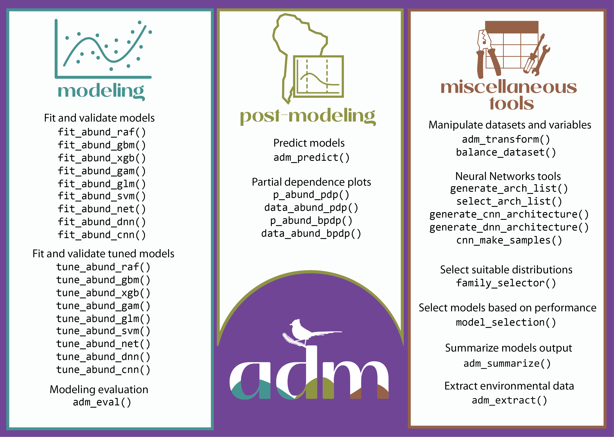

[](http://www.gnu.org/licenses/gpl-3.0.html) [](https://codecov.io/github/sjevelazco/adm) [](https://www.repostatus.org/#active)

# adm - Abundance-based species distribution models

### Overview

This package aims to support the construction of Abundance-based species distribution models, including data preparation, model fitting, prediction, and model exploration. The package offers several modeling approaches (i.e., algorithms) that users can fine-tune and customize. Models can be predicted in geographic space and explored regarding performance and response curves. Because modeling workflows in ***adm*** are constructed based on a combination of distinct functions and simple outputs, ***adm*** can be easily integrated into other packages.

### Structure of adm

***adm*** functions are grouped in three categories: modeling, post-modeling, and miscellaneous tools

<a href='https://x.github.io/adm'></a>

#### i) **modeling**

Functions to tune, fit, and validate models with nine different algorithms, with a suite of possible model-specific hyperparameters

***Fit and validate models without hyperparameters tuning***

[`fit_abund_cnn()`](fit_abund_cnn.html): Fit and validate Convolutional Neural Network Model

[`fit_abund_dnn()`](fit_abund_dnn.html): Fit and validate Deep Neural Network model

[`fit_abund_gam()`](fit_abund_gam.html): Fit and validate Generalized Additive Models

[`fit_abund_gbm()`](fit_abund_gbm.html): Fit and validate Generalized Boosted Regression models

[`fit_abund_glm()`](fit_abund_glm.html): Fit and validate Generalized Linear Models

[`fit_abund_net()`](fit_abund_net.html): Fit and validate Artificial Neural Network models

[`fit_abund_raf()`](fit_abund_raf.html): Fit and validate Random Forests models

[`fit_abund_svm()`](fit_abund_svm.html): Fit and validate Support Vector Machine models

[`fit_abund_xgb()`](fit_abund_xgb.html): Fit and validate Extreme Gradient Boosting models

***Fit and validate models with hyperparameters tuning***

[`tune_abund_cnn()`](tune_abund_cnn.html): Fit and validate Convolutional Neural Network with exploration of hyper-parameters that optimize performance

[`tune_abund_dnn()`](tune_abund_dnn.html): Fit and validate Deep Neural Network model with exploration of hyper-parameters that optimize performance

[`tune_abund_gam()`](tune_abund_gam.html): Fit and validate Generalized Additive Models with exploration of hyper-parameters that optimize performance

[`tune_abund_gbm()`](tune_abund_gbm.html): Fit and validate Generalized Boosted Regression models with exploration of hyper-parameters that optimize performance

[`tune_abund_glm()`](tune_abund_glm.html): Fit and validate Generalized Linear Models with exploration of hyper-parameters that optimize performance

[`tune_abund_net()`](tune_abund_net.html): Fit and validate Shallow Neural Networks models with exploration of hyper-parameters that optimize performance

[`tune_abund_raf()`](tune_abund_raf.html): Fit and validate Random Forest models with exploration of hyperparameters that optimize performance

[`tune_abund_svm()`](tune_abund_svm.html): Fit and validate Support Vector Machine models with exploration of hyper-parameters that optimize performance

[`tune_abund_xgb()`](tune_abund_xgb.html): Fit and validate Extreme Gradient Boosting models with exploration of hyper-parameters that optimize performance

Modeling evaluation

[`adm_eval()`](adm_eval.html): Calculate different model performance metrics

#### ii) **post-modeling**

Functions to predict abundance across space and construct partial dependence plots to explore the relationships between abundance and environmental predictors

[`adm_predict()`](adm_predict.html): Spatial predictions from individual and ensemble models

[`p_abund_bpdp()`](p_abund_bpdp.html): Bivariate partial dependence plots for abundance-based distribution models

[`p_abund_pdp()`](p_abund_pdp.html): Partial dependent plots for abundance-based distribution models

[`data_abund_bpdp()`](data_abund_bpdp.html): Calculate data to construct bivariate partial dependence plots

[`data_abund_pdp()`](data_abund_pdp.html): Calculate data to construct partial dependence plots

#### iii) **miscellaneous tools**

Extra functions to support the modeling workflow, including data handling, transformations, and hyperparameter selection.

[`adm_extract()`](adm_extract.html): Extract values from a spatial raster based on x and y coordinates

[`adm_summarize()`](adm_summarize.html): Merge model performance tables

[`adm_transform()`](adm_transform.html): Performs data transformation on a variable based on the specified method.

[`balance_dataset()`](balance_dataset.html): Balance database at a given absence-presence ratio

[`cnn_make_samples()`](cnn_make_samples.html): Creates sample data for Convolutional Neural Network

[`croppin_hood()`](croppin_hood.html): Crop rasters around a point (for Convolutional Neural Networks)

[`family_selector()`](family_selector.html): Select probability distributions for GAM and GLM

[`generate_arch_list()`](generate_arch_list.html): Generate architecture list for Deep Neural Network and Convolutional Neural Network

[`generate_cnn_architecture()`](generate_cnn_architecture.html): Generate architectures for Convolutional Neural Network

[`generate_dnn_architecture()`](generate_dnn_architecture.html): Generate architectures for Deep Neural Network

[`model_selection()`](model_selection.html): Best hyper-parameters selection

[`res_calculate()`](res_calculate.html): Calculate the output resolution of a layer

[`select_arch_list()`](select_arch_list.html): Select architectures for Convolutional Neural Network or Deep Neural Network

### Installation

You can install the development version of ***adm*** from [github](https://github.com/sjevelazco/adm)

``` r
# For Windows and Mac OS operating systems
remotes::install_github("sjevelazco/adm")
```
