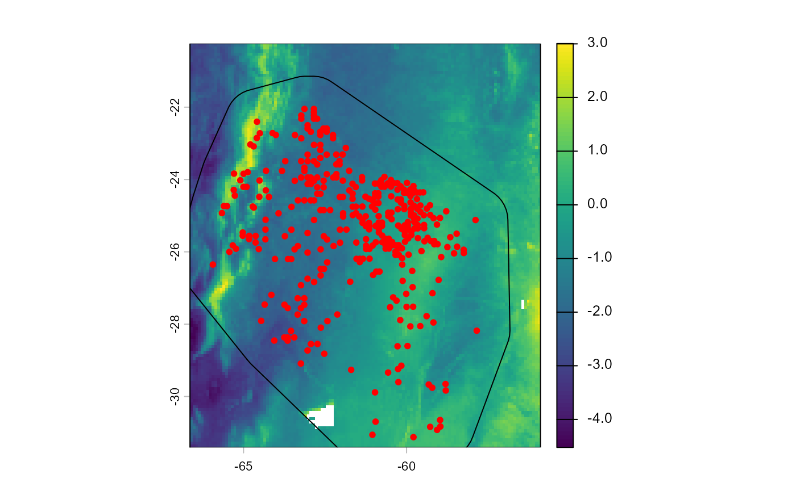
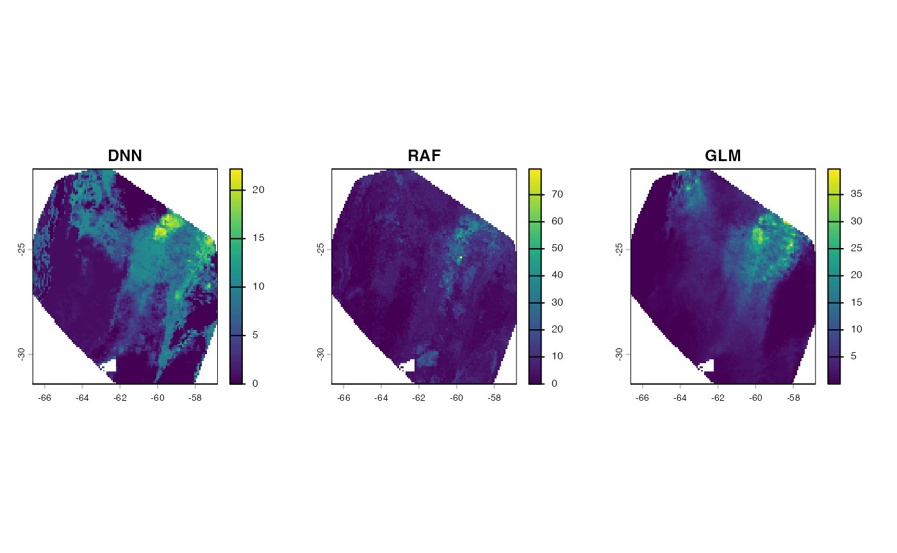

# 1. Modeling workflow with adm

## Introduction

Abundance-based Distribution Models (ADM) are promising approach to
construct spatially explicit correlative models of species abundance.
The *adm* package allow users to easily construct and validate those
models, meeting researches specific needs. In this vignette, users will
learn how to support a modeling workflow with *adm*, from data
preparation to model fitting and prediction.

## Installation

``` r
require(adm)
require(terra)
require(dplyr)
```

## Preparaing data

In this tutorial, we will model abundace of *Cynophalla retusa*
(Griseb.) Cornejo & Iltis (Capparaceae), a dry biome shrub native to
northeastern Argentina, Paraguay, Bolivia, and central Brazil. As
predictor variables, we will use the first 7 PC (cumulative viarance \>
90%) of a PCA performed with 35 climatic and edaphic variables. We can
load all needed data with:

``` r
# Load species abundance data
data("cretusa_data")


# Load raster with environmental variables
cretusa_predictors <- system.file("external/cretusa_predictors.tif", package = "adm")
cretusa_predictors <- terra::rast(cretusa_predictors)
names(cretusa_predictors)
#> [1] "PC1" "PC2" "PC3" "PC4" "PC5" "PC6" "PC7"

# Species training area
sp_train_a <- system.file("external/cretusa_calib_area.gpkg", package = "adm")
sp_train_a <- terra::vect(sp_train_a)
```

Let’s explore these data

``` r
# Species data
# ?cretusa_data
cretusa_data # species dat
#> # A tibble: 366 × 5
#>    species           ind_ha     x     y .part
#>    <chr>              <int> <dbl> <dbl> <int>
#>  1 Cynophalla retusa     10 -64.5 -22.7     1
#>  2 Cynophalla retusa     10 -64.1 -22.7     1
#>  3 Cynophalla retusa     20 -64.7 -23.1     2
#>  4 Cynophalla retusa      0 -62.6 -23.2     3
#>  5 Cynophalla retusa      0 -61.7 -24.5     3
#>  6 Cynophalla retusa      0 -61.6 -25.0     3
#>  7 Cynophalla retusa      0 -61.2 -24.5     3
#>  8 Cynophalla retusa      0 -64.9 -23.8     2
#>  9 Cynophalla retusa      0 -65.3 -24.4     3
#> 10 Cynophalla retusa      0 -64.7 -24.8     1
#> # ℹ 356 more rows
```

``` r
# Environmental predictors
names(cretusa_predictors)
#> [1] "PC1" "PC2" "PC3" "PC4" "PC5" "PC6" "PC7"
plot(cretusa_predictors)
```


``` r
# Training area
plot(sp_train_a)
```


``` r
plot(cretusa_predictors[[1]])
plot(sp_train_a, add = TRUE)
points(cretusa_data %>% dplyr::select(x, y), col = "red", pch = 20)
```



In `cretusa_data` we have 366 georeferenced points for *C. retusa*.
“ind_ha” column contains abundance measured in individuals per hectare.
“x” and “y” are decimals for longitude and latitude, respectively.
“.part” has folds of a spatial block partitioning used for
cross-validation. Now we need to extract environmental data from
predictors raster. For that, we will use *adm_extract*, and columns with
x and y coordinates will be important.

``` r
species_data <- adm_extract(
  data = cretusa_data, # georeferenced dataframe
  x = "x", # spatial x coordinates
  y = "y", # spatial y coordinates
  env_layer = cretusa_predictors, # raster with environmental variables
  variables = NULL, # return data for all layers
  filter_na = TRUE
)

species_data
#> # A tibble: 366 × 12
#>    species    ind_ha     x     y .part    PC1    PC2    PC3   PC4    PC5     PC6
#>    <chr>       <int> <dbl> <dbl> <int>  <dbl>  <dbl>  <dbl> <dbl>  <dbl>   <dbl>
#>  1 Cynophall…     10 -64.5 -22.7     1  1.50  -1.28   0.773 0.784 -0.249 -0.559 
#>  2 Cynophall…     10 -64.1 -22.7     1  0.750 -1.22   1.36  0.359 -0.434 -0.742 
#>  3 Cynophall…     20 -64.7 -23.1     2  1.21  -1.82   1.36  0.336 -0.862  0.0878
#>  4 Cynophall…      0 -62.6 -23.2     3 -1.71  -2.85  -1.34  0.762 -0.745 -1.02  
#>  5 Cynophall…      0 -61.7 -24.5     3 -1.65  -2.17  -1.68  0.175 -0.839 -0.637 
#>  6 Cynophall…      0 -61.6 -25.0     3 -1.29  -2.35  -1.94  0.614 -0.944 -0.805 
#>  7 Cynophall…      0 -61.2 -24.5     3 -0.904 -2.73  -2.30  1.05  -0.604 -0.830 
#>  8 Cynophall…      0 -64.9 -23.8     2  0.676 -1.57   0.401 1.54  -0.346 -0.417 
#>  9 Cynophall…      0 -65.3 -24.4     3  0.460 -0.795  0.409 2.19  -0.172 -0.249 
#> 10 Cynophall…      0 -64.7 -24.8     1  1.18   0.201  0.606 2.65  -0.356 -0.775 
#> # ℹ 356 more rows
#> # ℹ 1 more variable: PC7 <dbl>
```

Notice that the new dataframe have one column for each environmental
variable (layers in raster). It is possible to extract data from
specific layers using “variables” argument in *adm_extract*. To
stabilize Deep Neural Networks training, we will transform response data
using “zscore” method.

``` r
species_data <- adm_transform(
  data = species_data,
  variable = "ind_ha",
  method = "zscore"
)

species_data %>% dplyr::select(ind_ha, ind_ha_zscore)
#> # A tibble: 366 × 2
#>    ind_ha ind_ha_zscore
#>     <int>         <dbl>
#>  1     10        0.0754
#>  2     10        0.0754
#>  3     20        0.802 
#>  4      0       -0.651 
#>  5      0       -0.651 
#>  6      0       -0.651 
#>  7      0       -0.651 
#>  8      0       -0.651 
#>  9      0       -0.651 
#> 10      0       -0.651 
#> # ℹ 356 more rows
```

It creates a new column called “ind_ha_zscore”, which can be used as
response variable.

## Tuning models

With all set, we are good to proceed with ADM construction. In this
tutorial, we will fine-tune, fit and validate Deep Neural Network (DNN),
Generalized Linear Models (GLM) and Random Forest (RAF) models, using
*tune_abund\_* family functions.

### RAF

Starting with RAF, the first thing we need to do is to determine values
for hyperparameters to be tested. This could be done for all or just
part of the hyperparameters. In this example, we will set values for
all. This is done creating a grid which will guide the values
exploration, what can be easily constructed with *expand.grid* base
function:

``` r
raf_grid <- expand.grid(
  mtry = seq(from = 1, to = 7, by = 1),
  ntree = seq(from = 100, to = 1000, by = 100)
)
head(raf_grid)
#>   mtry ntree
#> 1    1   100
#> 2    2   100
#> 3    3   100
#> 4    4   100
#> 5    5   100
#> 6    6   100
nrow(raf_grid) # 70 combinations of these two hyper-paramenters
#> [1] 70
```

For RAF, “mtry” determines the number of variables randomly sampled as
candidates at each split. We setted it values to {1, 2, …, 6, 7}.
“ntree” determine the number of decision trees to grow. We set its
values to {100, 200, …, 900, 1000}. The grid combines every possible
pair of values, totalizing 70 combinations (number of rows in
“raf_grid”). Now we can use this grid with *tune_abund_raf* to tune and
validate a RAF model:

``` r
mraf <- tune_abund_raf(
  data = species_data,
  response = "ind_ha",
  predictors = c("PC1", "PC2", "PC3", "PC4", "PC5", "PC6", "PC7"),
  partition = ".part",
  predict_part = TRUE, # predictions for every partition will be returned
  grid = raf_grid,
  metrics = c("corr_pear", "mae"), # metrics to select the best model
  n_cores = 2, # number of cores to be used in parallel processing
  verbose = FALSE
)
#> Using provided grid.
#> Searching for optimal hyperparameters...
#> 
#> Fitting the best model...
#> The best model was achieved with: 
#>  mtry = 3 and ntree = 100
```

The function returns a list with the following elements:

``` r
names(mraf)
#> [1] "model"               "predictors"          "performance"        
#> [4] "performance_part"    "predicted_part"      "metadata"           
#> [7] "optimal_combination" "all_combinations"
```

“model”: a “randomForest” class object.

``` r
class(mraf$model)
#> [1] "randomForest.formula" "randomForest"
mraf$model
#> 
#> Call:
#>  randomForest(formula = formula1, data = data, mtry = mtry, ntree = ntree,      importance = FALSE) 
#>                Type of random forest: regression
#>                      Number of trees: 100
#> No. of variables tried at each split: 3
#> 
#>           Mean of squared residuals: 154.5952
#>                     % Var explained: 18.24
```

“predictors”: a tibble containing relevant informations about the model
fitted.

``` r
mraf$predictors
#> # A tibble: 1 × 9
#>   model response c1    c2    c3    c4    c5    c6    c7   
#>   <chr> <chr>    <chr> <chr> <chr> <chr> <chr> <chr> <chr>
#> 1 raf   ind_ha   PC1   PC2   PC3   PC4   PC5   PC6   PC7
```

“performance”: a tibble containing the best models’ performance.

``` r
mraf$performance
#> # A tibble: 1 × 13
#>   model mae_mean mae_sd corr_spear_mean corr_spear_sd corr_pear_mean
#>   <chr>    <dbl>  <dbl>           <dbl>         <dbl>          <dbl>
#> 1 raf       7.75   1.98           0.408         0.184          0.365
#> # ℹ 7 more variables: corr_pear_sd <dbl>, inter_mean <dbl>, inter_sd <dbl>,
#> #   slope_mean <dbl>, slope_sd <dbl>, pdisp_mean <dbl>, pdisp_sd <dbl>
```

“performance_part”: a tibble with the performance of each partition.

``` r
mraf$performance_part
#> # A tibble: 3 × 9
#>   replica partition model   mae corr_spear corr_pear  inter slope pdisp
#>   <chr>   <chr>     <chr> <dbl>      <dbl>     <dbl>  <dbl> <dbl> <dbl>
#> 1 1       1         raf    9.92      0.618     0.496 -0.435 1.23  0.404
#> 2 1       2         raf    7.29      0.334     0.331  2.42  0.502 0.659
#> 3 1       3         raf    6.04      0.272     0.268  2.07  0.574 0.467
```

“predicted_part”: predictions for each partition.

``` r
mraf$predicted_part %>% head()
#> # A tibble: 6 × 4
#>   replica partition observed predicted
#>   <chr>   <chr>        <int>     <dbl>
#> 1 1       1               10      1.14
#> 2 1       1               10      3.23
#> 3 1       1                0      0.75
#> 4 1       1               10      7.03
#> 5 1       1               10      7.58
#> 6 1       1               10      6.51
```

“optimal_combination”: the set of hyperparameters values considered the
best given the metrics and its performance.

``` r
mraf$optimal_combination %>% dplyr::glimpse()
#> Rows: 1
#> Columns: 16
#> $ comb_id         <chr> "comb_3"
#> $ mtry            <dbl> 3
#> $ ntree           <dbl> 100
#> $ model           <chr> "raf"
#> $ mae_mean        <dbl> 7.752958
#> $ mae_sd          <dbl> 1.978733
#> $ corr_spear_mean <dbl> 0.4077742
#> $ corr_spear_sd   <dbl> 0.1843192
#> $ corr_pear_mean  <dbl> 0.3649869
#> $ corr_pear_sd    <dbl> 0.1175491
#> $ inter_mean      <dbl> 1.352334
#> $ inter_sd        <dbl> 1.557785
#> $ slope_mean      <dbl> 0.7677054
#> $ slope_sd        <dbl> 0.3987553
#> $ pdisp_mean      <dbl> 0.5099857
#> $ pdisp_sd        <dbl> 0.132572
```

“all_combinations”: performance for every hyper-parameter combination.

``` r
mraf$all_combinations %>% head()
#>   comb_id mtry ntree model mae_mean   mae_sd corr_spear_mean corr_spear_sd
#> 1  comb_1    1   100   raf 7.813960 2.017926       0.4025162     0.2032571
#> 2  comb_2    2   100   raf 7.747226 2.033879       0.4074822     0.2012660
#> 3  comb_3    3   100   raf 7.752958 1.978733       0.4077742     0.1843192
#> 4  comb_4    4   100   raf 7.914473 2.073345       0.3837011     0.1823989
#> 5  comb_5    5   100   raf 7.747859 2.025944       0.4148284     0.1760800
#> 6  comb_6    6   100   raf 7.828127 1.987517       0.3957971     0.1810064
#>   corr_pear_mean corr_pear_sd inter_mean inter_sd slope_mean  slope_sd
#> 1      0.3683706    0.1314427  0.1869509 3.140764  0.9354092 0.6426653
#> 2      0.3497574    0.1241406  1.4048856 1.975473  0.7860210 0.4652657
#> 3      0.3649869    0.1175491  1.3523338 1.557785  0.7677054 0.3987553
#> 4      0.3050910    0.1248031  2.5319942 1.591738  0.6509941 0.4394166
#> 5      0.3235970    0.1355859  2.3228934 1.722592  0.6842002 0.4249527
#> 6      0.3049805    0.1470374  2.7259012 1.529523  0.6224873 0.4073050
#>   pdisp_mean  pdisp_sd
#> 1  0.4520509 0.1437945
#> 2  0.4878463 0.1460967
#> 3  0.5099857 0.1325720
#> 4  0.5255862 0.1625121
#> 5  0.5243141 0.1681618
#> 6  0.5352171 0.1516525
```

### GLM

To tune a GLM we perform basically the same steps to tune a RAF, paying
attention to GLM singularities. First, we need to construct a grid, just
like before. However, GLM needs a “distribution” hyper-parameter that
specifies the probability distribution family to be used. Choosing a
distribution family needs attention and must be done wisely, but *adm*
provides help via *family_selector* function. This function compares the
response variable range to the *gamlss* compatible families:

``` r
suitable_families <- family_selector(
  data = species_data,
  response = "ind_ha"
)
#> Response variable is discrete. Both continuous and discrete families will be tested.
#> Selected 61 suitable families for the data.
```

The function returns a tibble with suitable families information. The
column “family_call” can be directly used in a grid.

If you are interested in exploring the attributes of the families for
GLM and GAM, you can use the *families_bank* database. For further
details about family distributions see `?gamlss.dist::gamlss.family`.

``` r
fm <- system.file("external/families_bank.txt", package = "adm") %>%
  utils::read.delim(., header = TRUE, quote = "\t") %>%
  dplyr::as_tibble()
fm
#> # A tibble: 87 × 9
#>    family_name             family_call range no_parameters discrete accepts_zero
#>    <chr>                   <chr>       <chr>         <int>    <int>        <int>
#>  1 Beta                    BE          (0,1)             2        0            0
#>  2 Beta one inflated       BEOI        (0,1]             3        0            0
#>  3 Box-Cox Cole and Green  BCCG        (0, …             3        0            0
#>  4 Box-Cox Power Exponent… BCPE        (0, …             4        0            0
#>  5 Box-Cox-t               BCT         (0, …             4        0            0
#>  6 Exponential             EXP         (0, …             1        0            0
#>  7 Gamma                   GA          (0, …             2        0            0
#>  8 Generalized Beta type 1 GB1         (0,1)             4        0            0
#>  9 Generalized Beta type 2 GB2         (0, …             4        0            0
#> 10 Generalized Gamma       GG          (0, …             3        0            0
#> # ℹ 77 more rows
#> # ℹ 3 more variables: one_restricted <int>, accepts_one <int>,
#> #   accepts_negatives <int>
```

In this example, we selected some suitable distributions for use. Now,
we can construct the grid:

``` r
glm_grid <- list(
  distribution = c(
    "NO", "NOF", "RG", "TF", "ZAIG", "LQNO", "DEL",
    "PIG", "WARING", "YULE", "ZALG", "ZIP", "BNB",
    "DBURR12", "ZIBNB", "LO", "PO"
  ),
  poly = c(1, 2, 3),
  inter_order = c(0, 1, 2)
) %>%
  expand.grid()
# Note that in `distribution` argument it is necessary use the acronyms of `family_call` column
```

For GLM, “poly” refers to the polynomials used in model formula, and
“inter_order” refers to the interaction order between the variables.
Tuning the GLM with the grid:

``` r
mglm <- tune_abund_glm(
  data = species_data,
  response = "ind_ha",
  predictors = c("PC1", "PC2", "PC3", "PC4", "PC5", "PC6", "PC7"),
  predictors_f = NULL,
  partition = ".part",
  predict_part = TRUE,
  grid = glm_grid,
  metrics = c("corr_pear", "mae"),
  n_cores = 2,
  verbose = FALSE
)
#> Using provided grid.
#> Searching for optimal hyperparameters...
#> 
#> Fitting the best model...
#> The best model was achieved with:
#>  distribution = PO
#>  poly = 2
#>  inter_order = 0
```

The output is a list with basically the same elements as
*tune_abund_raf*, so we don’t need to go over it again. The only
difference here is the “model”, which is now is a “gamlss” class object.

``` r
class(mglm$model)
#> [1] "gamlss" "gam"    "glm"    "lm"
mglm$model
#> 
#> Family:  c("PO", "Poisson") 
#> Fitting method: RS() 
#> 
#> Call:  gamlss::gamlss(formula = formula1, sigma.formula = sigma_formula,  
#>     nu.formula = nu_formula, tau.formula = tau_formula,  
#>     family = family, data = data, control = control_gamlss,      trace = FALSE) 
#> 
#> 
#> Mu Coefficients:
#> (Intercept)          PC1          PC2          PC3          PC4          PC5  
#>   -0.539373     0.426482    -1.486044     0.500924     0.074328     0.447586  
#>         PC6          PC7     I(PC1^2)     I(PC2^2)     I(PC3^2)     I(PC4^2)  
#>   -1.497579     0.290151    -0.372255     0.004844     0.072316    -0.382721  
#>    I(PC5^2)     I(PC6^2)     I(PC7^2)  
#>    0.684274    -0.697127    -1.088711  
#> 
#>  Degrees of Freedom for the fit: 15 Residual Deg. of Freedom   351 
#> Global Deviance:     4604.94 
#>             AIC:     4634.94 
#>             SBC:     4693.48
```

### DNN

For DNN, in addition to a grid, the function *tune_abund_dnn* also needs
a list of architectures to test, or a single one. We will use
*generate_arch_list* function for this purpose, . However, here things
could get complicated. As DNN architecture aspects such the number and
size of layers, batch normalization, and dropout are customizable in
*adm*, many architectures could be generated at once, with all possible
combinations between these parameters, resulting in very large lists. To
filter this list, users can use *select_arch_list* to reduce it,
sampling the list using the number of parameters as a net complexity
measurement. This is highly recommended. Let’s create and select some
architectures:

``` r
archs <- adm::generate_arch_list(
  type = "dnn",
  number_of_features = 7, # input/predictor variables
  number_of_outputs = 1, # output/response variable
  n_layers = c(2, 3, 4), # possible number of layers
  n_neurons = c(7, 14, 21), # possible number of neurons on each layer
  batch_norm = TRUE, # batch normalization between layers
  dropout = 0 # without training dropout
)

number_before <- archs$arch_list %>% length() # 117

archs <- adm::select_arch_list(
  arch_list = archs,
  type = "dnn",
  method = "percentile", # sample by number of parameters percentiles
  n_samples = 2, # at least two with each number of layers
  min_max = TRUE # keep the more simple and the more complex networks
)

number_after <- archs$arch_list %>% length() # 52
```

However, for the sake of brevity in this tutorial, we will manually
reduce even more our architectures list to just a few:

``` r
archs$arch_list <- archs$arch_list[seq(from = 1, to = 52, by = 5)]

length(archs$arch_list)
#> [1] 11
```

Now we can construct the grid with hyper-parameters combinations. Note
that hyper-parameters values will be tested for each architecture.
Therefore user needs to be careful with grid and architecture list
sizes.

``` r
dnn_grid <- expand.grid(
  batch_size = c(64),
  validation_patience = c(5),
  fitting_patience = c(5),
  learning_rate = c(0.005, 0.001, 0.0005),
  n_epochs = 200
)
head(dnn_grid)
#>   batch_size validation_patience fitting_patience learning_rate n_epochs
#> 1         64                   5                5         5e-03      200
#> 2         64                   5                5         1e-03      200
#> 3         64                   5                5         5e-04      200
nrow(dnn_grid)
#> [1] 3
```

Now we can use the architectures generated and the grid created within
the *tune_abund_dnn* function:

``` r
mdnn <- tune_abund_dnn(
  data = species_data,
  response = "ind_ha_zscore", # using the transformed response
  predictors = c("PC1", "PC2", "PC3", "PC4", "PC5", "PC6", "PC7"),
  predictors_f = NULL,
  partition = ".part",
  predict_part = TRUE,
  grid = dnn_grid,
  architectures = archs,
  metrics = c("corr_pear", "mae"),
  n_cores = 2,
  verbose = FALSE
)
#> Using provided architectures.
#> Adding default hyperparameter for: weight_decay
#> Testing 99 combinations.
#> Searching for optimal hyperparameters...
#> 
#> Fitting the best model...
#> Warning: Some torch operators might not yet be implemented for the MPS device. A
#> temporary fix is to set the `PYTORCH_ENABLE_MPS_FALLBACK=1` to use the CPU as a
#> fall back for those operators:
#> ℹ Add `PYTORCH_ENABLE_MPS_FALLBACK=1` to your `.Renviron` file, for example use
#>   `usethis::edit_r_environ()`.
#> ✖ Using `Sys.setenv()` doesn't work because the env var must be set before R
#>   starts.
#> Some torch operators might not yet be implemented for the MPS device. A
#> temporary fix is to set the `PYTORCH_ENABLE_MPS_FALLBACK=1` to use the CPU as a
#> fall back for those operators:
#> ℹ Add `PYTORCH_ENABLE_MPS_FALLBACK=1` to your `.Renviron` file, for example use
#>   `usethis::edit_r_environ()`.
#> ✖ Using `Sys.setenv()` doesn't work because the env var must be set before R
#>   starts.
#> Some torch operators might not yet be implemented for the MPS device. A
#> temporary fix is to set the `PYTORCH_ENABLE_MPS_FALLBACK=1` to use the CPU as a
#> fall back for those operators:
#> ℹ Add `PYTORCH_ENABLE_MPS_FALLBACK=1` to your `.Renviron` file, for example use
#>   `usethis::edit_r_environ()`.
#> ✖ Using `Sys.setenv()` doesn't work because the env var must be set before R
#>   starts.
#> Some torch operators might not yet be implemented for the MPS device. A
#> temporary fix is to set the `PYTORCH_ENABLE_MPS_FALLBACK=1` to use the CPU as a
#> fall back for those operators:
#> ℹ Add `PYTORCH_ENABLE_MPS_FALLBACK=1` to your `.Renviron` file, for example use
#>   `usethis::edit_r_environ()`.
#> ✖ Using `Sys.setenv()` doesn't work because the env var must be set before R
#>   starts.
#> Some torch operators might not yet be implemented for the MPS device. A
#> temporary fix is to set the `PYTORCH_ENABLE_MPS_FALLBACK=1` to use the CPU as a
#> fall back for those operators:
#> ℹ Add `PYTORCH_ENABLE_MPS_FALLBACK=1` to your `.Renviron` file, for example use
#>   `usethis::edit_r_environ()`.
#> ✖ Using `Sys.setenv()` doesn't work because the env var must be set before R
#>   starts.
#> Some torch operators might not yet be implemented for the MPS device. A
#> temporary fix is to set the `PYTORCH_ENABLE_MPS_FALLBACK=1` to use the CPU as a
#> fall back for those operators:
#> ℹ Add `PYTORCH_ENABLE_MPS_FALLBACK=1` to your `.Renviron` file, for example use
#>   `usethis::edit_r_environ()`.
#> ✖ Using `Sys.setenv()` doesn't work because the env var must be set before R
#>   starts.
#> Some torch operators might not yet be implemented for the MPS device. A
#> temporary fix is to set the `PYTORCH_ENABLE_MPS_FALLBACK=1` to use the CPU as a
#> fall back for those operators:
#> ℹ Add `PYTORCH_ENABLE_MPS_FALLBACK=1` to your `.Renviron` file, for example use
#>   `usethis::edit_r_environ()`.
#> ✖ Using `Sys.setenv()` doesn't work because the env var must be set before R
#>   starts.
#> The best model was achieved with: 
#>  learning_rate = 0.005
#>  n_epochs = 200
#>  patience = 5 and 5
#>  batch_size = 64
#>  arch = 4 layers with 21->7->14->14 neurons
```

Again, the output is very similar as before, because they are
standardize for all *tune_abund\_* functions. Now, the “model” element
is a “luz_module_fitted” from *torch* and *luz* packages.

``` r
class(mdnn$model)
#> [1] "luz_module_fitted"
mdnn$model
#> A `luz_module_fitted`
#> ── Time ────────────────────────────────────────────────────────────────────────
#> • Total time: 17m 1.9s
#> • Avg time per training epoch: 1m 13s
#> 
#> ── Results ─────────────────────────────────────────────────────────────────────
#> Metrics observed in the last epoch.
#> 
#> ℹ Training:
#> loss: 0.5043
#> 
#> ── Model ───────────────────────────────────────────────────────────────────────
#> An `nn_module` containing 771 parameters.
#> 
#> ── Modules ─────────────────────────────────────────────────────────────────────
#> • linear1: <nn_linear> #168 parameters
#> • linear2: <nn_linear> #154 parameters
#> • linear3: <nn_linear> #112 parameters
#> • linear4: <nn_linear> #210 parameters
#> • output: <nn_linear> #15 parameters
#> • bn1: <nn_batch_norm1d> #42 parameters
#> • bn2: <nn_batch_norm1d> #14 parameters
#> • bn3: <nn_batch_norm1d> #28 parameters
#> • bn4: <nn_batch_norm1d> #28 parameters
```

### Summarizing results

In *adm* is possible to quick summarize several models evalutions in one
dataframe, using *adm_summarize* function:

``` r
adm_summarize(list(mdnn, mraf, mglm))
#> # A tibble: 3 × 14
#>   model_ID model mae_mean mae_sd corr_spear_mean corr_spear_sd corr_pear_mean
#>      <int> <chr>    <dbl>  <dbl>           <dbl>         <dbl>          <dbl>
#> 1        1 dnn      0.536  0.171           0.445         0.157          0.425
#> 2        2 raf      7.75   1.98            0.408         0.184          0.365
#> 3        3 glm      7.59   2.17            0.492         0.162          0.427
#> # ℹ 7 more variables: corr_pear_sd <dbl>, inter_mean <dbl>, inter_sd <dbl>,
#> #   slope_mean <dbl>, slope_sd <dbl>, pdisp_mean <dbl>, pdisp_sd <dbl>
```

## Predicting models

Once we fitted models, we can make spatial predictions of them. The
process is straightforward with the `adm_predict` function. It can make
predictions for more than one model at once. For illustration purposes,
we will make predictions for a calibration area delimited by a 100 km
buffered minimum convex polygon around species presence points, but this
process is optional.

``` r
sp_train_a <- system.file("external/cretusa_calib_area.gpkg", package = "adm")
sp_train_a <- terra::vect(sp_train_a)

preds <- adm::adm_predict(
  models = list(mraf, mglm),
  pred = cretusa_predictors,
  predict_area = sp_train_a,
  training_data = species_data,
  transform_negative = TRUE # negative predictions will be considered 0
)
#> Predicting a list of models
```

To predict DNN, we need to pay attention to some detail. As we trained
the DNN with tranformed response, if we want it to predict in the
original scale, we need to use the “invert_transform” argument in
*adm_predict*:

``` r
pred_dnn <- adm_predict(
  models = mdnn,
  pred = cretusa_predictors,
  predict_area = sp_train_a,
  training_data = species_data,
  transform_negative = TRUE,
  invert_transform = c(
    method = "zscore",
    a = mean(species_data$ind_ha),
    b = sd(species_data$ind_ha)
  )
)
#> Predicting an individual model
#> Warning: Some torch operators might not yet be implemented for the MPS device. A
#> temporary fix is to set the `PYTORCH_ENABLE_MPS_FALLBACK=1` to use the CPU as a
#> fall back for those operators:
#> ℹ Add `PYTORCH_ENABLE_MPS_FALLBACK=1` to your `.Renviron` file, for example use
#>   `usethis::edit_r_environ()`.
#> ✖ Using `Sys.setenv()` doesn't work because the env var must be set before R
#>   starts.
```

Note: transformation terms varies among tranformation methods. To learn
more about it, visit *adm_transform* documentation. Let’s visualize the
predictions:

``` r
par(mfrow = c(1, 3))
plot(pred_dnn$dnn, main = "DNN")
plot(preds$raf, main = "RAF")
plot(preds$glm, main = "GLM")
```



``` r
par(mfrow = c(1, 1))
```

## Exploring models

Finally, we can explore how a variable or a pair of variables affect the
predicted values. *adm* features univariate and bivariate Partial
Dependence Plots, PDP, and BPDP, respectively. To create PDP we use
`p_abund_pdp`. PDP illustrates the marginal response of one predictor.
It can provide very relevant information about residuals and model
extrapolation:

``` r
# PDP for DNN model
pdp_dnn <- p_abund_pdp(
  model = mdnn, # the output of tune_abund_ or fit_abund_
  predictors = c("PC1"),
  resolution = 100,
  resid = TRUE, # plot residuals
  training_data = species_data,
  invert_transform = c(
    method = "zscore", # same as before
    a = mean(species_data$ind_ha),
    b = sd(species_data$ind_ha)
  ),
  response_name = "ind/ha", # this argument is for aesthetic only, and determines the name of y axis
  projection_data = cretusa_predictors, # to visualize extrapolation
  rug = TRUE, # rug plot of the predictor
  colorl = c("#462777", "#6DCC57"), # projection and training values, respectively
  colorp = "black", # residuals colors
  alpha = 0.2,
  theme = ggplot2::theme_classic() # a ggplot2 theme
)
#> Warning: Some torch operators might not yet be implemented for the MPS device. A
#> temporary fix is to set the `PYTORCH_ENABLE_MPS_FALLBACK=1` to use the CPU as a
#> fall back for those operators:
#> ℹ Add `PYTORCH_ENABLE_MPS_FALLBACK=1` to your `.Renviron` file, for example use
#>   `usethis::edit_r_environ()`.
#> ✖ Using `Sys.setenv()` doesn't work because the env var must be set before R
#>   starts.
#> Some torch operators might not yet be implemented for the MPS device. A
#> temporary fix is to set the `PYTORCH_ENABLE_MPS_FALLBACK=1` to use the CPU as a
#> fall back for those operators:
#> ℹ Add `PYTORCH_ENABLE_MPS_FALLBACK=1` to your `.Renviron` file, for example use
#>   `usethis::edit_r_environ()`.
#> ✖ Using `Sys.setenv()` doesn't work because the env var must be set before R
#>   starts.

# PDP for GLM model
pdp_glm <- p_abund_pdp(
  model = mglm,
  predictors = c("PC1"),
  resolution = 100,
  resid = TRUE,
  training_data = species_data,
  response_name = "ind/ha",
  projection_data = cretusa_predictors,
  rug = TRUE,
  colorl = c("#462777", "#6DCC57"),
  colorp = "black",
  alpha = 0.2,
  theme = ggplot2::theme_classic()
)

# PDP for RAF model
pdp_raf <- p_abund_pdp(
  model = mraf,
  predictors = c("PC1"),
  resolution = 100,
  resid = TRUE,
  training_data = species_data,
  response_name = "ind/ha",
  projection_data = cretusa_predictors,
  rug = TRUE,
  colorl = c("#462777", "#6DCC57"),
  colorp = "black",
  alpha = 0.2,
  theme = ggplot2::theme_classic()
)
```

``` r
pdp_dnn
```


``` r
pdp_raf
```


``` r
pdp_glm
```


BPDP are similar to PDP, but instead of one, it illustrates the marginal
response of a pair of variables. In this example we will use the first
and seventh PC. Note that for `p_abund_pdp` and `p_abund_bpdp`, any
subset of predictors can be used in the “predictors” argument. If
“predictors” argument is NULL, functions plot all variables or variables
pair combinations, respectively.

``` r
# BPDP for DNN
bpdp_dnn <- p_abund_bpdp(
  model = mdnn,
  predictors = c("PC1", "PC7"), # a pair of predictors
  resolution = 100,
  training_data = species_data,
  projection_data = cretusa_predictors,
  training_boundaries = "convexh", # the shape in which the training boundaries are drawn. Outside of it, its extrapolations
  invert_transform = c(
    method = "zscore", # same as before
    a = mean(species_data$ind_ha),
    b = sd(species_data$ind_ha)
  ),
  response_name = "ind/ha",
  color_gradient = c(
    "#000004", "#1B0A40", "#4A0C69", "#781B6C", "#A42C5F", "#CD4345",
    "#EC6824", "#FA990B", "#F7CF3D", "#FCFFA4"
  ), # gradient for response variable
  color_training_boundaries = "white",
  theme = ggplot2::theme_classic()
)
#> Warning: Some torch operators might not yet be implemented for the MPS device. A
#> temporary fix is to set the `PYTORCH_ENABLE_MPS_FALLBACK=1` to use the CPU as a
#> fall back for those operators:
#> ℹ Add `PYTORCH_ENABLE_MPS_FALLBACK=1` to your `.Renviron` file, for example use
#>   `usethis::edit_r_environ()`.
#> ✖ Using `Sys.setenv()` doesn't work because the env var must be set before R
#>   starts.

# BPDP for GLM
bpdp_glm <- p_abund_bpdp(
  model = mglm,
  predictors = c("PC1", "PC7"),
  resolution = 100,
  training_data = species_data,
  projection_data = cretusa_predictors,
  training_boundaries = "convexh",
  response_name = "ind/ha",
  color_gradient = c(
    "#000004", "#1B0A40", "#4A0C69", "#781B6C", "#A42C5F", "#CD4345",
    "#EC6824", "#FA990B", "#F7CF3D", "#FCFFA4"
  ),
  color_training_boundaries = "white",
  theme = ggplot2::theme_classic()
)

# BPDP for RAF
bpdp_raf <- p_abund_bpdp(
  model = mraf,
  predictors = c("PC1", "PC7"),
  resolution = 100,
  training_data = species_data,
  projection_data = cretusa_predictors,
  training_boundaries = "convexh",
  response_name = "ind/ha",
  color_gradient = c(
    "#000004", "#1B0A40", "#4A0C69", "#781B6C", "#A42C5F", "#CD4345",
    "#EC6824", "#FA990B", "#F7CF3D", "#FCFFA4"
  ),
  color_training_boundaries = "white",
  theme = ggplot2::theme_classic()
)
```

``` r
bpdp_dnn
```


``` r
bpdp_raf
```


``` r
bpdp_glm
```


## Conclusions

In this vignette, we explored *adm* tools to support complete ADM
workflows. The package features functions from model tuning, fitting,
and validation to model prediction and exploration.
